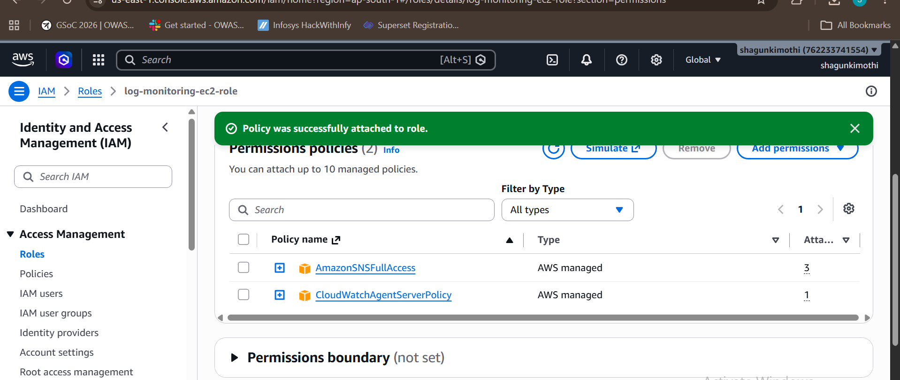
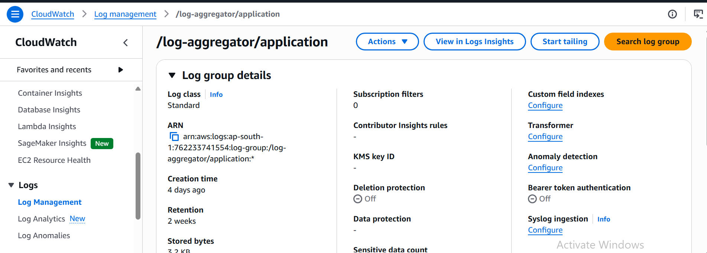
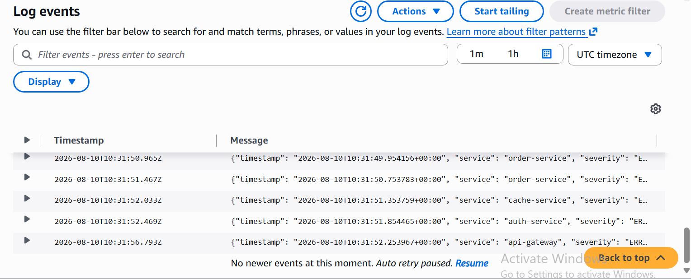
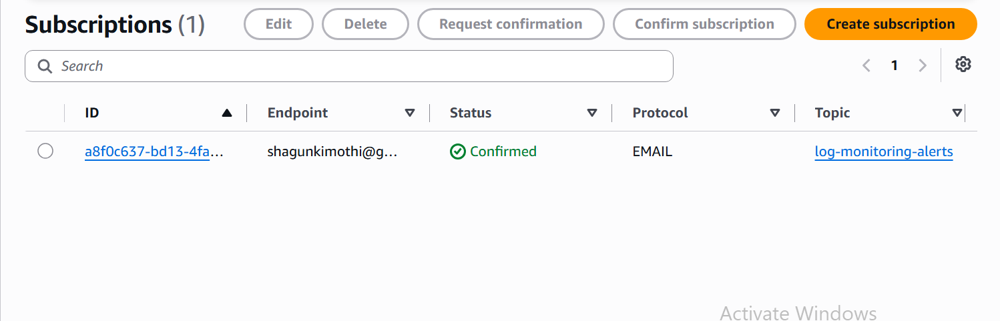

# Cloud-Based Intelligent Log Aggregation & Incident Analysis Platform

An incident-intelligence platform that turns structured application logs into
correlated incidents, timelines, optional AI analysis, alerts, and reusable
engineering knowledge. It is designed to sit on top of a log source; it is not
a replacement for CloudWatch, ELK, or Splunk.

The full application can be run locally with Docker. A new user does **not**
need to install Python, Node.js, PostgreSQL, or AWS tools for the local demo.
Docker starts the backend, frontend, collector, and database in containers.

## What it does

- Generates realistic ecommerce workflow logs with optional injected failures.
- Collects logs from a local file for the demo, or from AWS CloudWatch Logs.
- Validates, normalizes, and deduplicates every collected log before storage.
- Correlates related warning/error logs into incidents and assigns severity.
- Creates a chronological incident timeline and exposes it on the dashboard.
- Stores resolved incidents and engineer feedback as searchable historical knowledge.
- Optionally requests evidence-based Gemini analysis and sends consolidated SNS alerts.

## Local architecture

For the default local demo, every component runs on the same computer through
Docker Compose:

```text
Browser (http://localhost:5173)
        |
        v
React frontend  ----->  FastAPI backend (http://localhost:8000)
                              |
                              v
                         PostgreSQL database

Simulation -> logs/application.log -> Collector -> PostgreSQL -> Correlation
                                                          |
                                                          v
                                                Incidents and timelines
```

The simulator writes newline-delimited JSON logs to `logs/application.log`.
The collector polls that file, stores valid rows in PostgreSQL, and marks them
as unprocessed. The backend's correlation loop reads those database rows,
creates incidents and timelines, and the frontend fetches all dashboard data
through the backend API. The dashboard does **not** read the log file directly.

In AWS mode, only the source portion changes:

```text
Application -> CloudWatch Agent -> CloudWatch Logs -> Collector -> PostgreSQL
```

Everything after collection continues to use the same stored-log format.

## Technology

| Area | Technology |
| --- | --- |
| Frontend | React, Vite, Tailwind CSS, Axios |
| Backend API | Python, FastAPI, SQLAlchemy |
| Database | PostgreSQL 16 |
| Log sources | Local JSON log file or AWS CloudWatch Logs |
| AI (optional) | Google Gemini |
| Notifications (optional) | AWS SNS |
| Local runtime | Docker and Docker Compose |

## Prerequisites

For the recommended Docker setup, install only:

1. [Docker Desktop](https://www.docker.com/products/docker-desktop/), with Docker Compose enabled.
2. Git, if you are cloning the repository rather than receiving the project folder.

Before continuing, open Docker Desktop and wait until its engine is running.

### Windows note

Docker Desktop needs permission to mount the drive containing this repository.
If Docker reports a bind-mount or file-sharing error, enable sharing for that
drive in Docker Desktop settings, then restart Docker Desktop.

## Run locally on any computer

These instructions assume the project folder is already present on the other
person's computer.

### 1. Open a terminal in the project directory

PowerShell example:

```powershell
cd "C:\path\to\Cloud-Based-Intelligent-Log-Aggregation-Incident-Analysis-Platform"
```

### 2. Create a local environment file

```powershell
Copy-Item .env.example .env
```

The default `.env.example` values are enough for the local demo. Do not commit
the generated `.env` file; it is already ignored by Git and is the correct
place for private API keys or AWS settings.

### 3. Build and start the stack

```powershell
docker compose up --build
```

The first run downloads base images and installs dependencies, so it can take a
few minutes. Later starts are usually faster. Keep this terminal open while
using the application.

Docker starts these services:

| Service | Purpose | Local address |
| --- | --- | --- |
| `frontend` | React dashboard | http://localhost:5173 |
| `backend` | FastAPI API and correlation loop | http://localhost:8000 |
| `postgres` | Persistent application database | `localhost:5432` |
| `collector` | Reads local logs and inserts them into PostgreSQL | Internal service |

### 4. Open and verify the application

- Dashboard: http://localhost:5173
- API health check: http://localhost:8000/api/health
- Interactive API documentation: http://localhost:8000/docs

The health endpoint should report `"status": "ok"`. A database connection is
available after the PostgreSQL container passes its health check.

## Demo workflow

Use this workflow to show the complete application without AWS or paid cloud
resources:

1. Open the dashboard at http://localhost:5173.
2. Open **Simulation** and choose `database_timeout`.
3. Click **Start simulation**.
4. Wait a few seconds for the collector to import the generated logs.
5. On **Overview** or **Incidents**, click **Run correlation**. The backend also
   runs correlation automatically every two seconds.
6. Open the created incident to view its timeline and related database logs.
7. Optionally request Gemini analysis if `GEMINI_API_KEY` is configured.
8. Add engineer feedback, then resolve the incident. The final resolution is
   stored in the knowledge base for later similarity retrieval.

### Engineer feedback storage

The feedback form saves its data in the PostgreSQL `feedback` table against the
incident ID. At present, the dashboard does not reload or display a previously
saved feedback form after it is submitted. When an incident is resolved, the
engineer's actual root cause, actual resolution, and comments are copied into
the related knowledge-base record. The current Knowledge Base screen displays
the root cause and resolution, but not the engineer comments.

Available injected failures:

- `database_timeout`
- `redis_failure`
- `payment_api_timeout`
- `auth_failure`
- `cpu_spike`
- `disk_full`
- `none` for a healthy workflow run

## Configuration

All configuration is read from `.env`. The important local variables already
have working defaults in `.env.example`.

| Variable | Default / local value | Purpose |
| --- | --- | --- |
| `DATABASE_URL` | PostgreSQL service URL | Backend database connection |
| `COLLECTOR_DATABASE_URL` | PostgreSQL service URL | Collector database connection |
| `LOG_SOURCE` | `local` | Selects the local-file or CloudWatch collector |
| `LOCAL_LOG_FILE` | `/var/log/log-aggregator/application.log` | File read by the containerized collector |
| `COLLECTOR_POLL_INTERVAL_SECONDS` | `2` | How often the collector checks for logs |
| `CORRELATION_POLL_INTERVAL_SECONDS` | `2` | How often the backend checks unprocessed database logs |
| `MAX_INCIDENT_GAP_SECONDS` | `900` | Splits widely separated logs into different incidents |
| `GEMINI_API_KEY` | empty | Enables live Gemini analysis when supplied |
| `SNS_TOPIC_ARN` | empty | Enables SNS alerts when supplied |

### Optional Gemini analysis

Without a key, incident collection, correlation, timelines, feedback, and the
knowledge base still work. The API reports that AI analysis is unavailable.

## AWS integration evidence (optional)

AWS is not required for the localhost demo. The following screenshots document
the optional CloudWatch and SNS setup used to validate the cloud integration.
Setup reference files are in `docs/aws/`.

### IAM role policies

The collector role has the policies required to read CloudWatch logs and send
notifications through SNS.



### CloudWatch log group

The application log group receives structured application logs before the
collector normalizes them into PostgreSQL records.



### CloudWatch log events

The events shown below are structured JSON application logs available to the
CloudWatch collector.



### SNS subscription

The SNS topic has a confirmed email subscription for consolidated incident
notifications.



## API overview

| Method | Endpoint | Purpose |
| --- | --- | --- |
| `GET` | `/api/health` | Backend and database health |
| `GET` | `/api/simulation/workflows` | Available workflows |
| `GET` | `/api/simulation/failures` | Available failure scenarios |
| `POST` | `/api/simulation/start` | Start a simulated run |
| `POST` | `/api/simulation/stop` | Stop the active simulation |
| `GET` | `/api/simulation/status` | Current simulation state |
| `POST` | `/api/incidents/correlate` | Correlate unprocessed database logs now |
| `GET` | `/api/incidents` | List incidents |
| `GET` | `/api/incidents/{id}` | Incident details |
| `GET` | `/api/incidents/{id}/timeline` | Incident timeline |
| `GET` | `/api/incidents/{id}/logs` | Logs belonging to an incident |
| `POST` | `/api/incidents/{id}/analysis` | Request Gemini analysis |
| `POST` | `/api/incidents/{id}/feedback` | Save engineer feedback |
| `POST` | `/api/incidents/{id}/resolve` | Resolve and store knowledge-base evidence |
| `GET` | `/api/dashboard/summary` | Dashboard counters and recent incidents |
| `GET` | `/api/knowledge-base` | Resolved-incident knowledge records |

Full request/response documentation is available at http://localhost:8000/docs
while the backend is running.

## Troubleshooting

| Problem | Likely cause | What to do |
| --- | --- | --- |
| `port is already allocated` | Another application uses port 5432, 8000, or 5173 | Stop the conflicting application or change the matching port in `docker-compose.yml`. |
| Frontend says backend is unavailable | Backend has not started or is unhealthy | Check the backend container logs in Docker Desktop and visit `/api/health`. |
| Simulation completes but no incident appears | Collector has not imported logs yet | Check the collector container logs in Docker Desktop, wait a few seconds, then run correlation. |
| Database schema errors after old local runs | Existing volume predates a schema change | Reset the local Docker database volume only if you intentionally want a fresh database. |
| AI analysis unavailable | `GEMINI_API_KEY` is empty or invalid | Add a valid key to `.env`, then rebuild/restart containers. |
| Docker bind-mount failure on Windows | Docker Desktop cannot access the project drive | Allow the drive in Docker Desktop settings and restart Docker Desktop. |

## Project layout

```text
backend/                 FastAPI app, database models, APIs, services, simulation engine
frontend/                React/Vite dashboard
collector/               Local-file and CloudWatch collectors, normalization, deduplication
docs/                    Data contract and AWS setup reference
docs/aws/                CloudWatch Agent configuration and IAM policy
tests/                   Backend test suite
docker-compose.yml       Local multi-container runtime
.env.example             Safe configuration template
```

The folders `correlation_engine/`, `incident_builder/`, `timeline_engine/`,
`knowledge_base/`, `llm_engine/`, and `alert_service/` contain phase-level
documentation. Their active implementation is consolidated under
`backend/app/services/` and related backend modules.

## Data contract

`docs/data_contract.md` defines the canonical log shape used after collection.
Any new log source should translate its events to that shape in the collector.
Downstream code should read database log records rather than raw CloudWatch or
simulator payloads.

## Security and repository hygiene

- Keep `.env` private. It may contain Gemini keys, SNS ARNs, or environment-specific settings.
- Never commit AWS access keys or database passwords.
- Change the example PostgreSQL password before using this outside a local demo.
- The local database is persisted in Docker's `postgres_data` volume until it is intentionally removed.
